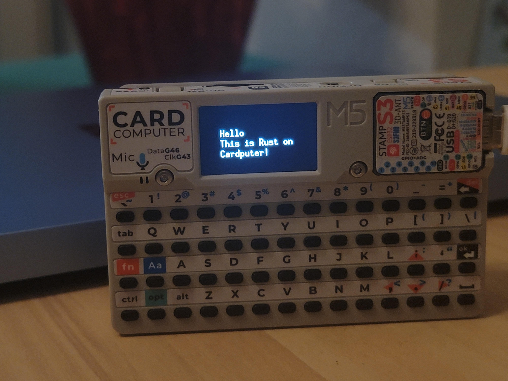

# Cardputer Text Example

This is a simple program that uses `embedded-graphics`, `display-interface-spi`, `mipidsi`, and `embedded-hal-bus` to display a simple string on the M5Stack Cardputer's built-in ST7789V2 display.

## Building

**⚠️ IMPORTANT**: You need to have the esp Rust toolchain installed first. See next section for details.

```
git clone https://github.com/gamersekofy/cardputer-text-example.git
cd cardputer-text-example
cargo build
cargo run
```

## Toolchain Information

You need to install the esp Rust toolchain, developed by Espressif.

I recommend reading the [Rust on ESP Book](https://docs.espressif.com/projects/rust/book/) before installing the toolchain.

If you want to skip directly to installation instructions, go to the [toolchain installation section of the book](https://docs.espressif.com/projects/rust/book/getting-started/toolchain.html).

## Environment Information

This project was made on a Snapdragon X Plus laptop running Windows 11. It's definitely possible to do Rust on ESP development on ARM64.

## Picture


